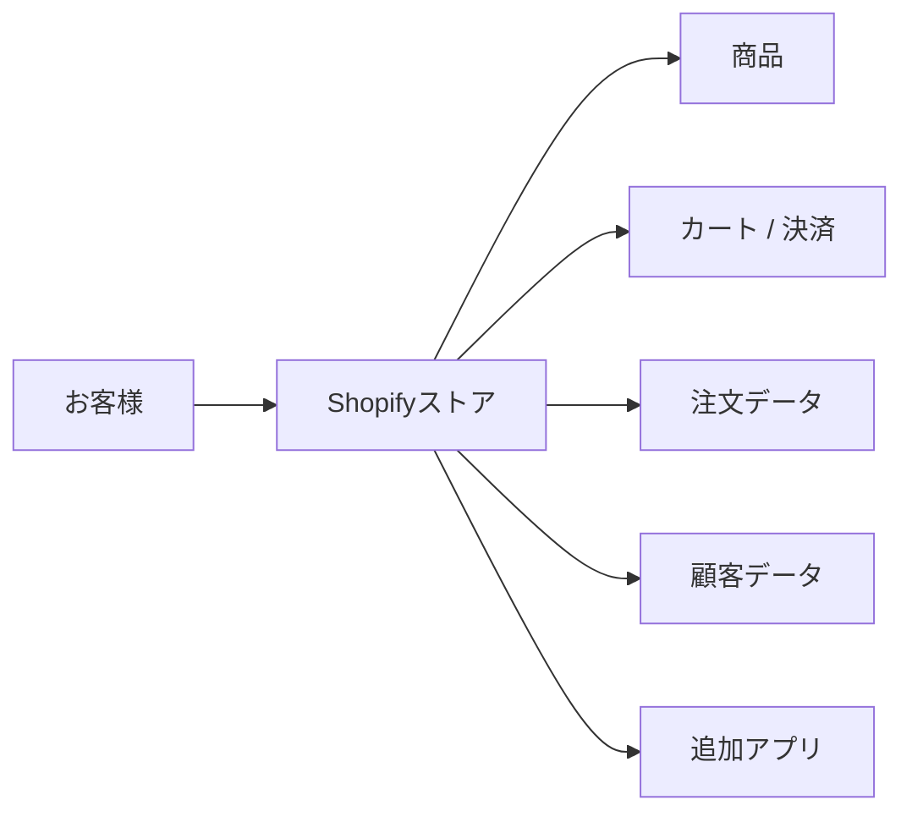
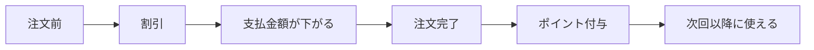
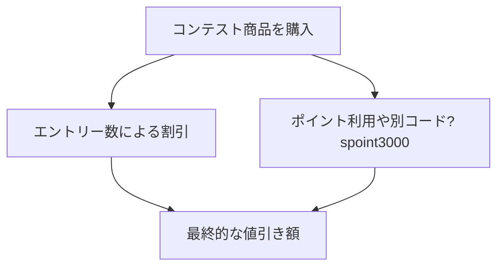
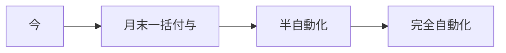
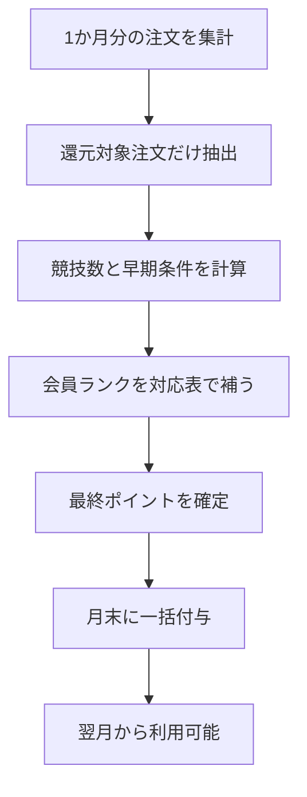
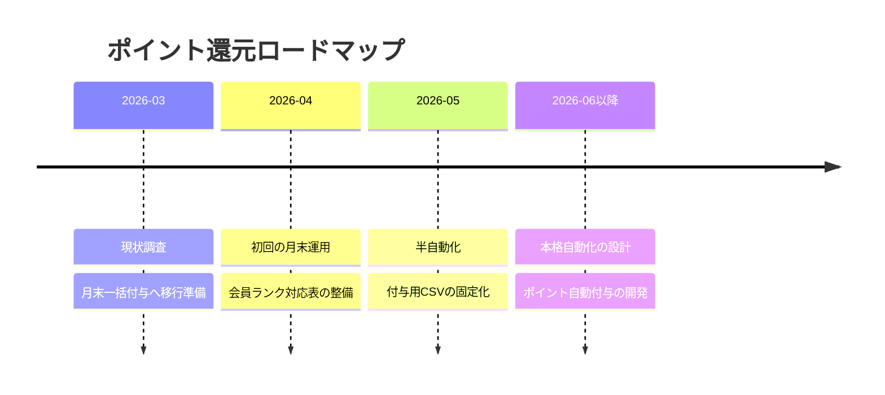

# Shopify Reward Beginner Guide

## この資料の目的

この資料は、2026年3月19日時点の FWJ ストアのポイント還元運用について、プログラミングや Shopify の知識がない人でも全体像を理解できるようにするための入門資料です。

この資料を読むと、次のことがわかります。

- Shopify は何をする仕組みか
- 今のストアで何が起きているか
- なぜポイント還元が複雑になっているか
- 直近はどう運用すべきか
- 将来はどう自動化していくか

## 1. Shopify をとても簡単に言うと

Shopify は「ネットショップを動かすための土台」です。

ざっくり言うと、次の役割があります。

- 商品を並べる
- お客様がカートに入れる
- 決済する
- 注文を記録する
- 顧客情報を持つ
- アプリを追加して機能を増やす

イメージはこうです。

## 2. アプリとは何か

Shopify の標準機能だけでは足りないことがあります。

そのときに追加するのが「アプリ」です。

たとえば次のようなものがあります。

- ポイントアプリ
- レビューアプリ
- 会員アプリ
- 割引を細かく制御するアプリ

今回のストアでは、ポイントまわりに `Easy Points` 系の仕組みがすでに使われている可能性が高いです。

## 3. 今回やりたいこと

やりたいことはシンプルです。

1. 商品を買ったときに割引を入れる
2. 支払金額に応じてポイントも付ける

ただし、実際の仕組みは次の 2 つに分かれています。

- その場で安くする: `割引`
- あとで使えるようにする: `ポイント`

## 4. いまストアで起きていること

今回の調査で、次のことがわかりました。

### 4-1. ストアプラン

- ストアは `Shopify` プラン
- `Shopify Plus` ではない

これは大事です。なぜなら、Plus でないと使いにくい開発方法があるからです。

### 4-2. 既存ポイントの仕組み

顧客データには、すでにポイント関連の情報が入っていました。

見つかったもの:

- `loyalty.balance`
- `loyalty.easy_points_attributes`
- `loyalty.tier_uid`

つまり、ポイント機能は「まだ無い」のではなく、「すでに別の仕組みが動いている」状態です。

### 4-3. 商品のタグ

コンテスト商品には、次のようなタグが付いていました。

- `還元対象`
- `no-easy-points`
- `コンテストエントリー`

これは非常に重要です。

意味としては、おそらく次のようになっています。

- `還元対象`: この商品は特別還元の対象
- `no-easy-points`: Easy Points の通常ポイントは付けない
- `コンテストエントリー`: コンテスト申込商品

### 4-4. 割引の実態

注文には、次の割引が見つかりました。

- `1エントリー割引`
- `2エントリー割引`
- `spoint3000`

つまり、いまの値引きは 1 個の仕組みではなく、複数の仕組みが重なっている状態です。

## 5. なぜ難しいのか

難しい理由は、単に「計算式が複雑」だからではありません。

本当の理由は、次の 4 つです。

1. 割引の仕組みがすでに本番で動いている
2. ポイントもすでに別の仕組みで動いている
3. 商品タグで細かく対象外制御している
4. 会員ランクがストア内だけでは完全に読み取れない

そのため、今いきなり全部を作り直すと危険です。

## 6. 今の計画

今の計画は、「いったん安全な運用に寄せる」ことです。

### 6-1. 直近

- 月末にまとめてポイント付与
- 翌月から使えるようにする

### 6-2. 後でやること

- 自動でポイント計算
- 自動でポイント付与
- 管理画面から確認できるようにする

## 7. 直近の運用イメージ

月末運用は、次の流れです。

## 8. すでに作ったもの

今回の調査で、月末運用のための下地はすでに作成済みです。

### 調査資料

- [shopify-reward-investigation-notes.md](/Users/takashiwada/Documents/CodeX/ShopifyApp/docs/shopify-reward-investigation-notes.md)
- [shopify-store-audit.json](/Users/takashiwada/Documents/CodeX/ShopifyApp/docs/shopify-store-audit.json)
- [shopify-reward-report.json](/Users/takashiwada/Documents/CodeX/ShopifyApp/docs/shopify-reward-report.json)

### 月末付与の下地

- [shopify-monthly-points.json](/Users/takashiwada/Documents/CodeX/ShopifyApp/docs/shopify-monthly-points.json)
- [shopify-monthly-points.csv](/Users/takashiwada/Documents/CodeX/ShopifyApp/docs/shopify-monthly-points.csv)
- [shopify-member-rank-map.json](/Users/takashiwada/Documents/CodeX/ShopifyApp/docs/shopify-member-rank-map.json)

## 9. いま分かっていること / まだ分からないこと

### 分かっていること

- コンテスト商品はタグで抽出できる
- ポイント対象商品は `還元対象` で見分けられる
- 通常の Easy Points 付与は `no-easy-points` で止めている可能性が高い
- 3月分では対象注文 68 件を抽出できた

### まだ分からないこと

- `G5`, `G9`, `G11` などがどの会員ランクか
- Easy Points の管理画面で還元率が整数しか入らないか
- `spoint3000` がどの運用から発行されているか

## 10. 直近でやること

次にやることは非常に具体的です。

1. `Gタグ` と会員ランクの対応表を埋める
2. 月末ポイント CSV の最終値を確定する
3. 付与担当者向けの手順を固定する
4. 1回分の月末運用を実施する

## 11. その後のロードマップ

### Phase 1. 暫定運用

- 月末集計
- 手確認
- 一括付与

### Phase 2. 半自動化

- 対応表を使って自動計算
- 付与用CSVを自動生成
- 二重付与防止

### Phase 3. 本格自動化

- 注文時に自動計算
- ポイント自動付与
- 管理画面で確認

## 12. 最後に

いま必要なのは「全部を正しく作り直すこと」ではなく、「事故なく、説明できる形で運用すること」です。

その意味で、今の一番よい進め方は次です。

- 本番を大きく触らない
- 月末一括付与で整える
- ルールを見える化する
- その後に自動化する

この順番なら、無理に急いで壊すよりずっと安全です。
